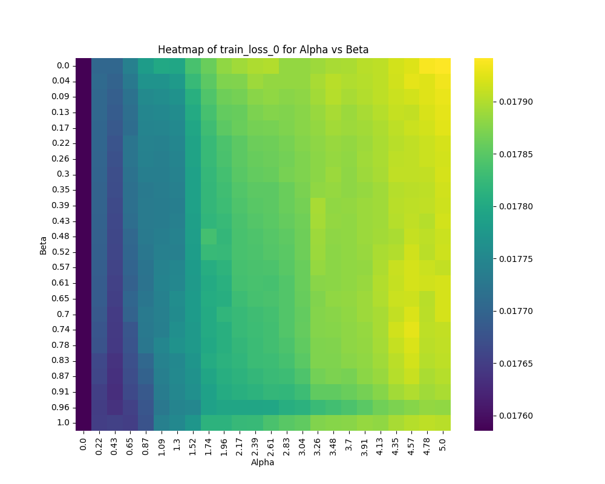
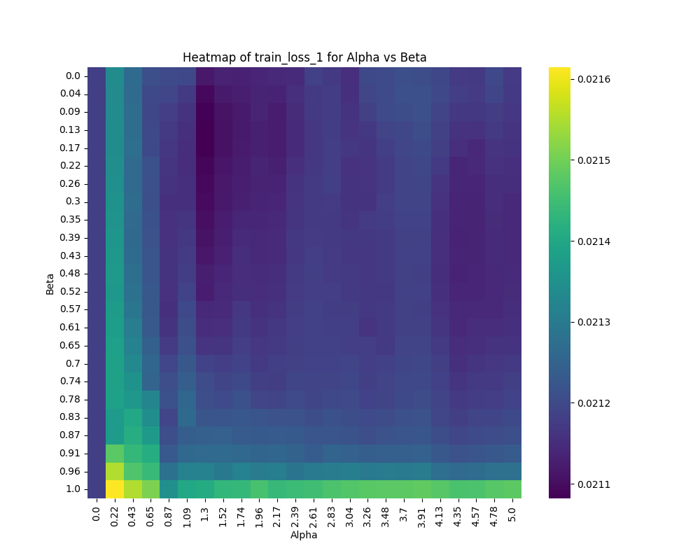
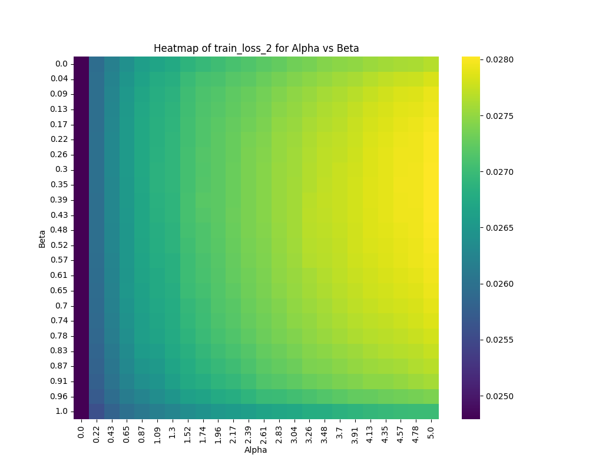
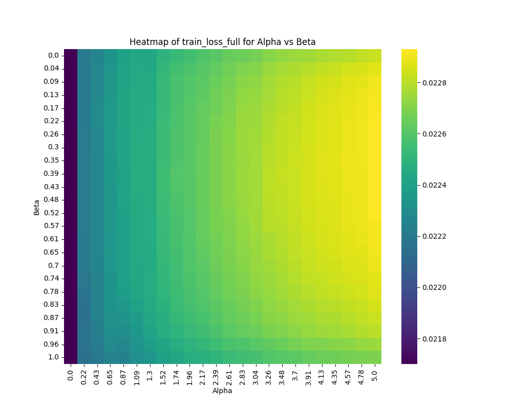

# Never Forget

Implementation of "Overcoming Catastrophic Forgetting in Neural Networks" (Kirkpatrick et al, 2017) https://arxiv.org/pdf/1612.00796.pdf

This is training an S4 audio prediction model with 23,000 parameters using an audio dataset split into 3 parts.  Sets of songs on the playlist are separate parts.  The goal is to modify a normal model so that parts 0,1 (trained earlier) have lower loss after later training part 2 by introducing a weight regularization term based on the paper.  So, can we still remember the songs we heard earlier?

The scripts perform a hyperparameter sweep and results are presented as heatmaps below to draw conclusions about the efficacy of the proposed regularization term for very small models.  For much larger or more complex models, the proposed regularization term be more or less effective.  Scroll down for the results for small models.

## Setup

Requires conda: https://docs.anaconda.com/free/miniconda/#quick-command-line-install

```bash
git clone https://github.com/catid/never_forget.git
cd never_forget

conda create -n nf python=3.10 -y && conda activate nf

pip install -r requirements.txt

# Download audio dataset for training
python download_dataset.py

# Verify that training works
python train.py
```

## Distributed Experiment

Set up each server:

```bash
git clone https://github.com/catid/never_forget.git
cd never_forget

conda create -n nf python=3.10 -y && conda activate nf

pip install -r requirements.txt

# Download audio dataset for training
python download_dataset.py

python command_server.py
```

On client side, edit the `hosts.txt` file to point to the servers you want to use.  Modify the `remote_csv_path` variable in `combine_results.py` to point at the file path on your servers.  Use `ssh-copy-id servername` to copy your public key to all servers so that the scripts do not need a password.

```bash
git clone https://github.com/catid/never_forget.git
cd never_forget

conda create -n nf python=3.10 -y && conda activate nf

pip install -r requirements.txt

# Launch job
python command_client_grid.py

# Download results and combine them
python combine_results.py

# Graph results, producing heatmaps as .png files
python graph_results.py
```

## Experiment Results

We first take out a random set of the audio dataset for validation.

The dataset splits are from consecutive samples, so they are e.g. from the same group of audio files in the dataset.  During training they are shuffled within each of these splits as normal.

The training script trains the same model on each part 0, 1, 2, one after the other.  We're hoping that by adding the FIM regularization term, the model will be able to better remember the previous training examples, so at the end we hope to have lower loss on parts 0, 1 than we would if we did not use the FIM regularization term.

The `alpha` parameter is multiplied by the FIM loss, so 0 means no regularization, which is what you'd expect with a model that is not using the FIM regularization term proposed in the paper.

The `beta` parameter is more of a detail.  It modifies the EWMA decay rate of the FIM regularization term for each weight element.  It measures how much it remembers the previous training example FIM terms when moving from part 1 to part 2 of the dataset.  So `beta` should choose a trade-off between part 0 and part 1 loss at the end.

We present hyperparameter sweep results as heatmaps below, showing the impact of different values of `alpha` and `beta` on the loss of all parts, and each part individually, as well as the validation loss.  Each number in the heatmap is one experiment run.

## Dataset Split 0

As `alpha` increases, it should reduce the loss on part 0 since the model is remembering the previous training examples.

As `beta` increases, it should also reduce the loss on part 0 since the regularization terms are preferring part 0 over part 1.



## Dataset Split 1

As `alpha` increases, it should reduce the loss on part 1 since the model is remembering the previous training examples.

As `beta` increases, it should also worsen (increase) the loss on part 1 since the regularization terms are preferring part 0 over part 1.



## Dataset Split 2

As `alpha` increases, it should increase the loss on part 2 since the model is remembering the previous training examples rather than specializing on the final dataset split.

I am not expecting `beta` to have an effect on the loss of the final part.



## Full Training Set

To see how it performs in aggregate, here's the full training set loss (better is smaller), which measures how well it recalls the training examples in general:



## Validation Set

Here's the validation set loss (better is smaller), which measures how well the model generalizes to unseen data:


## Results for Small Models

Generally the results are worse than baseline.  The only positive result is that dataset split 1 (the middle one) has lower loss when the approach is applied at alpha=1.3 and beta=0.3, but overall the regularized network has worse generalization performance than the baseline in all other areas.  The fact that there is some measurable improvement at all does hint at the approach being more interesting at larger sizes.

As a result it does not seem to be a good idea to use this regularization term in practice for small models on smaller datasets, which are mainly learning general features in common across the entire dataset.  Again the dataset has only 2053 audio clips in its training tensor (split 3 ways) and the model has only 23,000 parameters.

The authors of the paper were focused on reinforcement learning, which has very different requirements.  Not sure how large the model is but I'm sure it's at least 1M parameters since it's a DQN architecture.  They trained 50,000 trajectories (25x more data).  So the model that is trained here is significantly smaller and in a different regime entirely.

Future work: Train a larger multi-layer Mamba model with a larger dataset using DeepSpeed to speed up training.
